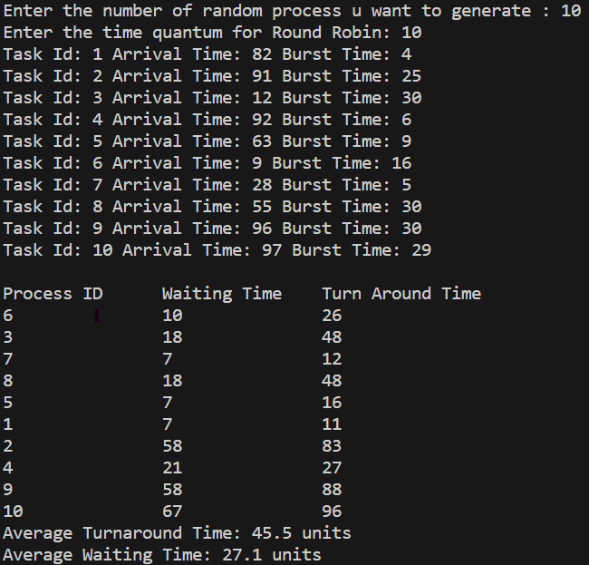

# Round Robin Scheduling Simulation

This project is a simulation of the Round Robin scheduling algorithm, implemented in C++. It aims to generate a set of processes with random arrival times and CPU burst times, run the Round Robin scheduling algorithm for a specified duration, and record the average waiting time and turnaround time for each process. The results will be compared with the ideal scenario of a perfect scheduler.

> [!IMPORTANT]
>
> ### Prerequisites
>
> Before you begin, ensure you have the following installed:
>
> - C++ Compiler (e.g., g++)
> - Git (for cloning the repository)

## To run the program run this script from the 'src' directory :

```
g++ main.cpp ../entities/Process.cpp -o main
./main.exe
```

## Program Output



## Gantt Chart Output


